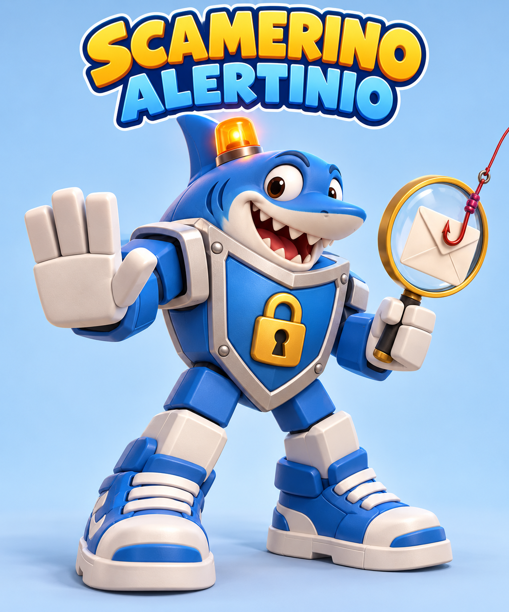

# MakeNoMistakesTeam

## BezpiecznaAura

**BezpiecznaAura** to nazwa naszego projektu — kreskówkowego pomocnika, który uczy dzieci 10–13 lat rozpoznawać phishing, wyłudzanie danych i pułapki zakupowe (HackYeah 2026, ścieżka Defence). Szczegóły: `.planning/PROJECT.md`.

### Maskotka

Maskotką rozwiązania jest **Scamerinio Alertinio**.



### Projekty w repozytorium

Kod poszczególnych projektów znajduje się w [`projects/`](projects/README.md).
Rozszerzenie przeglądarkowe jest w [`projects/widget/`](projects/widget/README.md).
Pozostałe projekty mogą korzystać z sąsiednich katalogów `projects/api-ui/`,
`projects/roblox/` i `projects/presentation/`.

Wspólne zasoby graficzne pozostają w `assets/`, a kontrakt, treści i planowanie
w `.planning/`. Każdy projekt ma własne zależności i polecenia budowania.

Budowanie widgetu z głównego katalogu repozytorium:

```sh
npm --prefix projects/widget ci
npm --prefix projects/widget run build
```

W Chrome załaduj rozpakowane rozszerzenie z `projects/widget/dist/`.
