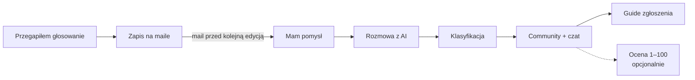

# Budżet obywatelski — koncepcja apki

Stan na 2026-10-03 · HackYeah 2026

Apka prowadzi mieszkańca od luźnego pomysłu do zgłoszenia go w budżecie obywatelskim i łączy go z ludźmi, którzy chcą tego samego. Start: Kraków, demo na HackYeah 2026.

Dokument źródłowy (Claude Doc): https://claude.ai/code/artifact/49df3d52-7481-4727-a858-e202b7ea9a63

## Ścieżka w skrócie

Mail przed kolejną edycją zaprasza też do zgłoszenia pomysłu, więc spóźnieni wyborcy wpadają na ścieżkę „Mam pomysł”.

## Wejście 1: „Mam pomysł”

Mieszkaniec ma pomysł, ale nie wie, jak zacząć — i znajduje nas.

1. **Miasto.** Na start pytamy, skąd jest (na hackathon: Kraków). To pierwszy i najmocniejszy filtr community.
2. **Rozmowa z AI.** Bot nie nadaje nazwy na siłę — pomaga zrozumieć, co mieszkaniec chce zbudować, po co i jaki problem to rozwiązuje.
3. **Klasyfikacja.** AI ustala rodzaj projektu (np. zieleń, rowery, sport) i poziom: dzielnicowy (wtedy też dzielnica) albo ogólnomiejski.
4. **Community.** Mieszkaniec trafia do istniejącego community podobnych pomysłów albo zakładamy dla niego nowe, do którego trafią kolejne osoby.
5. **Guide.** Community ma swój przewodnik: gdzie i jak zgłosić projekt tego typu.
6. **Ocena 1–100 (opcjonalna).** Panel agentów-ekspertów ocenia pomysł i opisuje, co jest okej, a co może pójść nie tak.

## Wejście 2: „Przegapiłem głosowanie”

Mieszkaniec trafia na budżet obywatelski, gdy głosowanie już się skończyło.

1. **Zapis.** Zostawia e-mail, miasto i rejon (dzielnicę).
2. **Powiadomienie.** Przed kolejną edycją w swoim rejonie dostaje maila.

Zgłaszanie projektów odbywa się kilka miesięcy przed głosowaniem. Mail może więc też zaprosić do zgłoszenia własnego pomysłu — i wtedy wejście 2 prowadzi prosto do wejścia 1.

## Community

Community to serce apki: ludzie z podobnym pomysłem w tym samym mieście trafiają do jednej grupy.

| Poziom | Przykład | Dla jakich pomysłów |
| --- | --- | --- |
| Dzielnicowe | Kraków, Podgórze — zieleń | Mniejsze, lokalne projekty |
| Ogólnomiejskie | Kraków — ścieżki rowerowe | Projekty obejmujące całe miasto |

- **Tworzenie.** Jeśli podobnego community jeszcze nie ma, zakładamy je dla pierwszej osoby, a kolejne trafiają już tam.
- **Czat.** Członkowie dogadują się sami na wspólnym czacie.
- **Guide.** Przewodnik dopasowany do rodzaju i poziomu projektu: gdzie zgłosić (pula dzielnicowa czy ogólnomiejska), jak, w jakim terminie i co jest wymagane.

Na start obsługujemy tylko budżet obywatelski. Inne programy (np. Zielony Budżet) mogą dojść później.

## Ocena 1–100

Ocena jest opcjonalna. Na start najważniejsze jest prowadzenie ludzi dalej, a ocena to dodatek.

- **Kto ocenia.** Panel agentów-ekspertów AI. Każdy patrzy na pomysł ze swojej strony.
- **Na czym opiera ocenę.** Na podobnych projektach z poprzednich edycji: co wygrało, co przepadło i dlaczego.
- **Co widzi mieszkaniec.** Wynik w skali 1–100 oraz opis: co jest okej, a co może pójść nie tak.
- **Czego nie robimy.** Nie wyceniamy kosztów projektu.

Wymaga to bazy poprzednich projektów z Krakowa — trzeba ją zbudować.

## Demo na HackYeah

W 10 minut prezentacji pokazujemy oba wejścia, z naciskiem na wejście 1, na prawdziwych danych z Krakowa.

- **Zakres danych:** Kraków na start, ale baza i model przygotowane od razu na kolejne miasta.
- **Wejście 1:** pełna ścieżka — rozmowa, klasyfikacja, community z czatem, guide, ocena.
- **Wejście 2:** zapis na powiadomienia i przykładowy mail przed kolejną edycją.

## Otwarte pytania

- [ ] Jacy eksperci zasiadają w panelu agentów (np. urzędnik od wymogów formalnych, urbanista, mieszkaniec-sceptyk)?
- [ ] Skąd bierzemy bazę poprzednich projektów z Krakowa i co w niej trzymamy?
- [ ] Jak AI decyduje, że dwa pomysły są „podobne” i trafiają do jednego community?
- [ ] Pod który track HackYeah zgłaszamy projekt?
